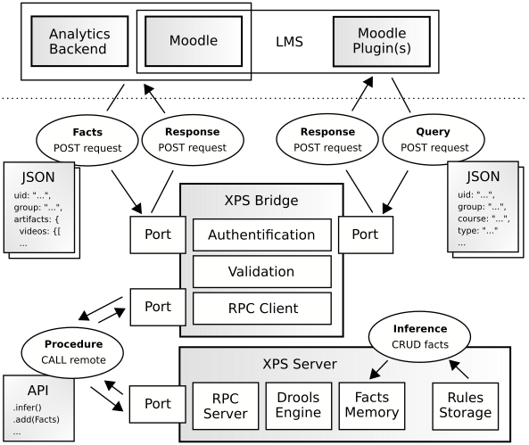

# IKARion XPS Bridge

## Architecture

 

## Requests

### Authentification

* Request method is "POST".
* Content type has to be "application/json".
* Authorization mechanism is "Token".
* Accepted clients are
  * Moodle Learning Management System (events),
  * Learning Analytics Backend (models),
  * Moodle Plugins (queries),
  * XPS Recover (events and models) and
  * XPS Screen (queries).
* Each client must use its **own token** to become distinguishable at the bridge.

